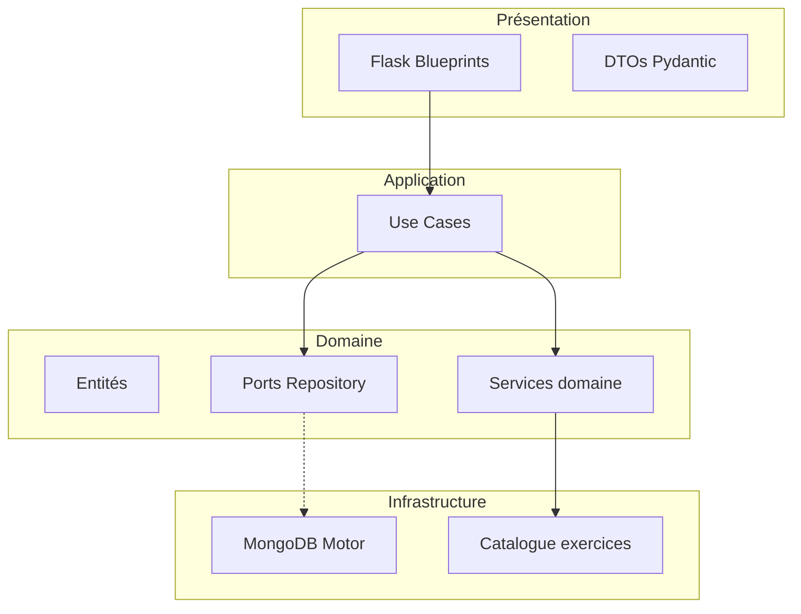

# Architecture — API IA HealthAI Coach

## Contexte métier (MSPR TPRE502)

HealthAI Coach est une plateforme holistique (nutrition + sport + biométrie). Ce micro-service couvre :

| Contexte | Périmètre cahier des charges | Statut |
|----------|------------------------------|--------|
| **workout** | Moteur multi-critères, planification hebdomadaire, feedback adaptatif | Implémenté |
| **nutrition** | Vision repas, macros, plans alimentaires | Stub (use case prêt) |

Référence complète : [mspr-contexte.md](./mspr-contexte.md).

## Clean architecture

### Dépendances (règle)

Les flèches vont **vers l'intérieur** : `presentation → application → domain ← infrastructure`.

- Le **domaine** ne connaît ni Flask ni Motor.
- L'**application** orchestre le domaine via des ports (`Protocol`).
- L'**infrastructure** implémente les ports.
- La **composition** (`container.py`) assemble le tout au démarrage.

## Use cases actuels

| Use case | Contexte | Endpoint |
|----------|----------|----------|
| `CreateWorkoutProgramUseCase` | workout | `POST /recommendations/workout` |
| `SubmitWorkoutFeedbackUseCase` | workout | `POST /recommendations/workout/{id}/feedback` |
| `AnalyzeMealUseCase` | nutrition | `POST /api/nutrition/analyze` |

## Persistance

MongoDB (collections `workout_programs`, `user_fitness_profiles`, `workout_feedbacks`). Schéma : [mongodb-schema.md](./mongodb-schema.md).

## Évolutions prévues

- **nutrition** : adaptateurs Hugging Face / Google Vision dans `infrastructure/`
- **nutrition** : entités `MealAnalysis`, port `MealAnalysisRepository` si persistance
- Rate limiting / cache (MSPR § III.3) en infrastructure partagée
